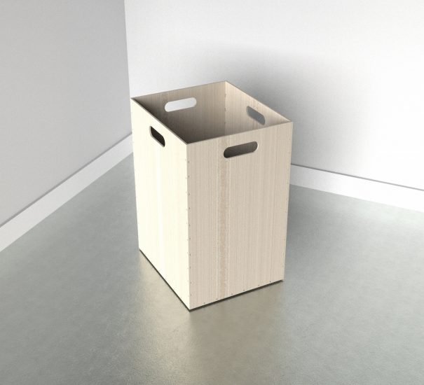

#### cnc-wood-bins

Wooden Bins CNC  - 2 bins per 8ft x 4ft sheet

wooden bins 

A wooden bin designed to be cut from 6mm birch ply.  
This design uses CNC finger joints and needs to be  
assembled with wood glue. Fits two bins to a standard 8 x 4 sheet.

RHINO 3DM FILE
##### DOWNLOAD

DWG FILE
##### DOWNLOAD

IGS FILE
##### DOWNLOAD

